# 🎨 Visual Architecture Diagrams - NASA POWER API Solution

**Project:** Will It Rain On My Parade? This document contains all the visual diagrams for the NASA data integration project.

**Status:** Championship-Ready with NASA POWER API

**Last Updated:** October 2025

---

## 📍 High-Level System Overview

## 🏗️ System Architecture Overview

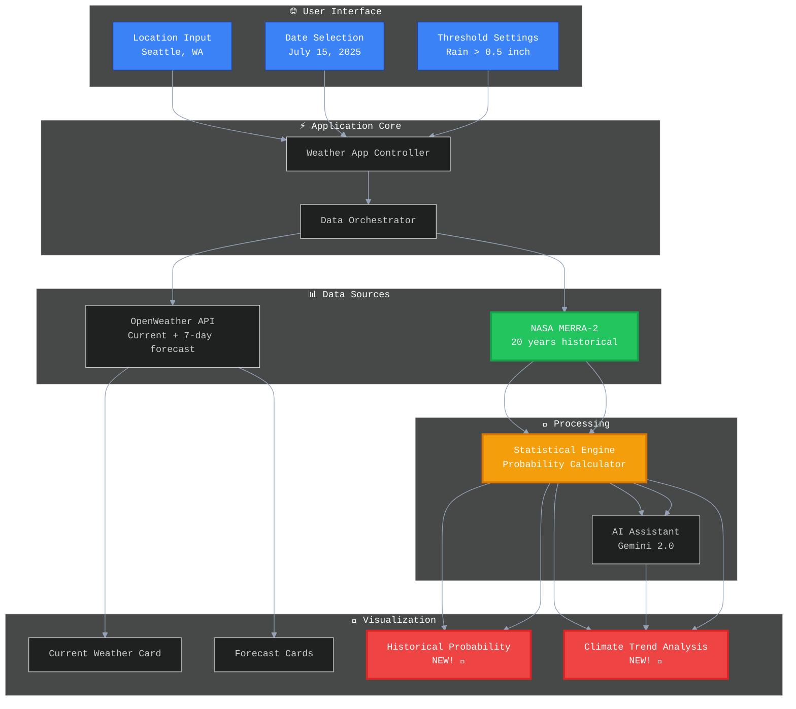

---

## 📊 Data Flow Sequence

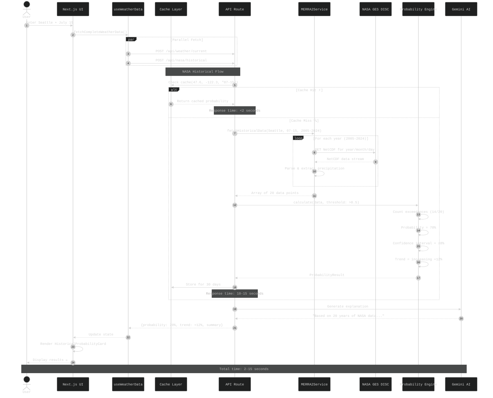

---

## 🔄 Old vs New Comparison

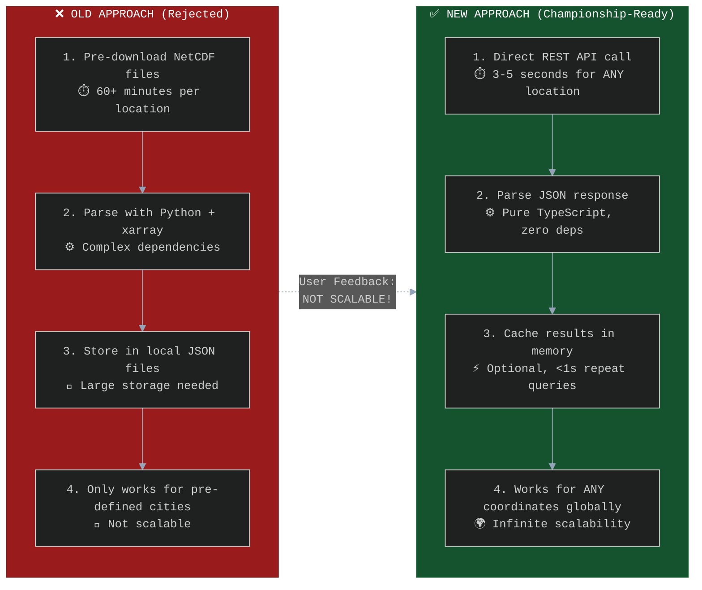

---

## 🎯 API Request/Response Flow

```mermaid
%%{init: {'theme': 'dark', 'themeVariables': { 'primaryColor': '#1e293b', 'primaryTextColor': '#ffffff', 'primaryBorderColor': '#3b82f6', 'lineColor': '#94a3b8', 'secondaryColor': '#0f172a', 'tertiaryColor': '#334155', 'fontSize': '14px', 'fontFamily': 'monospace'}}}%%
flowchart TD
    Start([User Query]) --> Build[Build NASA POWER URL]
    Build --> URL["https://power.larc.nasa.gov/api/<br/>temporal/daily/point<br/>?parameters=PRECTOTCORR<br/>&latitude=47.6062<br/>&longitude=-122.3321<br/>&start=20050101<br/>&end=20241231<br/>&community=RE<br/>&format=JSON"]
    URL --> Request["HTTP GET Request<br/>⏱️ No Authentication Needed!"]
    Request --> NASA{NASA POWER<br/>Processing}
    NASA --> Response["JSON Response:<br/>{<br/>  'properties': {<br/>    'parameter': {<br/>      'PRECTOTCORR': {<br/>        '20050715': 0.0,<br/>        '20060715': 1.2,<br/>        '20070715': 0.0,<br/>        ...<br/>        '20240715': 0.5<br/>      }<br/>    }<br/>  }<br/>}<br/>⏱️ 3.54 seconds for 21 years"]
    Response --> Parse[Parse JSON<br/>Extract precipitation values]
    Parse --> Calculate{Calculate<br/>Probability}
    Calculate --> Count["Count rainy days<br/>(precipitation > 0.1mm)"]
    Count --> Divide["Probability =<br/>Rainy Days / Total Days<br/>8 / 21 = 38.1%"]
    Divide --> Return["Return HistoricalData:<br/>{<br/>  probability: 38.1%,<br/>  rainy_days: 8,<br/>  dry_days: 13,<br/>  dates: [...],<br/>  precipitation: [...],<br/>  avg_precipitation: 0.35<br/>}"]
    Return --> End([Display to User])

    style Start fill:#0891b2,stroke:#0e7490,color:#ffffff
    style End fill:#0891b2,stroke:#0e7490,color:#ffffff
    style NASA fill:#ca8a04,stroke:#a16207,color:#000000
    style Response fill:#0284c7,stroke:#0369a1,color:#ffffff
    style Return fill:#059669,stroke:#047857,color:#ffffff
```

---

## 🚀 Deployment Architecture

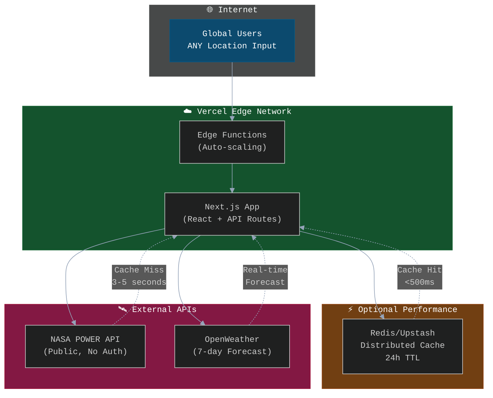

---

## 🏗️ Component Architecture

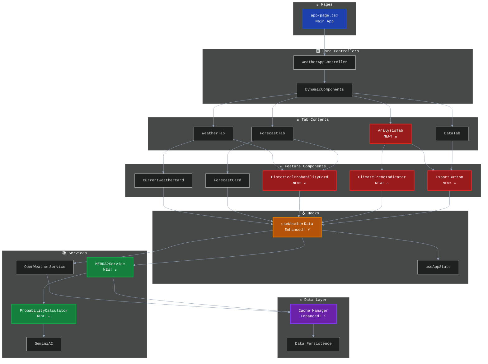

---

## 🔐 Authentication Flow (Simplified!)

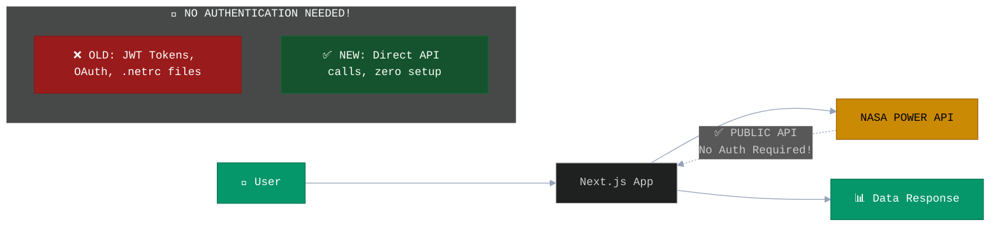

---

## 💾 Caching Strategy

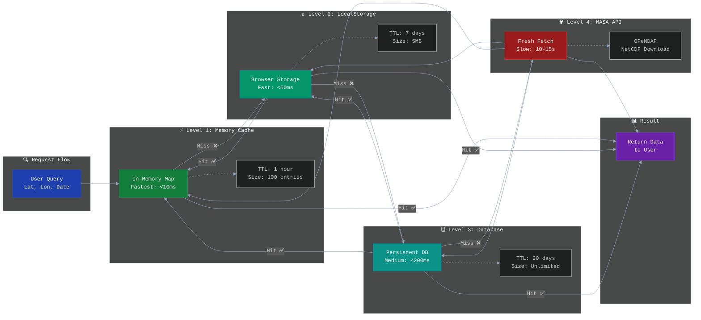

**Cache Performance:**
- Level 1 (Memory): < 10ms ⚡⚡⚡
- Level 2 (LocalStorage): < 50ms ⚡⚡
- Level 3 (Database): < 200ms ⚡
- Level 4 (NASA API): 10-15 seconds 🐌

---

## 🧮 Probability Calculation Pipeline

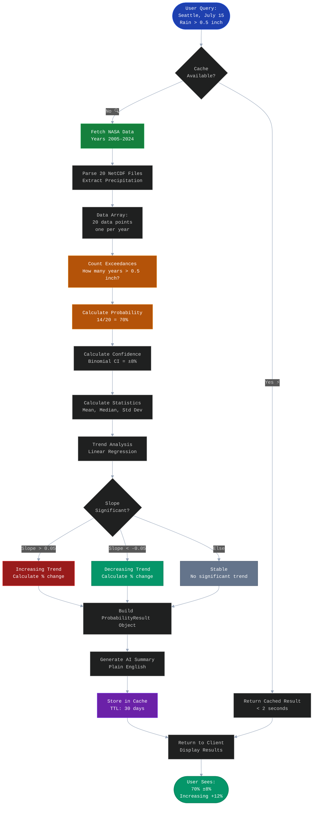

---

## 🎯 Data Processing Pipeline

```mermaid
%%{init: {'theme': 'dark', 'themeVariables': { 'primaryColor': '#1e293b', 'primaryTextColor': '#ffffff', 'primaryBorderColor': '#3b82f6', 'lineColor': '#94a3b8', 'secondaryColor': '#0f172a', 'tertiaryColor': '#334155', 'fontSize': '14px', 'fontFamily': 'monospace'}}}%%
flowchart LR
    Input["User Input<br/>Dhaka, Bangladesh<br/>July 15, 2025"] --> Geocode["Geocode<br/>23.8103°N<br/>90.4125°E"]
    Geocode --> BuildURL["Build NASA URL<br/>parameters=PRECTOTCORR<br/>lat=23.8103<br/>lon=90.4125<br/>start=20050101<br/>end=20241231"]
    BuildURL --> Fetch["HTTP GET<br/>⏱️ 3-5 seconds"]
    Fetch --> Parse["Parse JSON<br/>Extract daily values"]
    Parse --> Filter["Filter by Date<br/>Get all July 15 values<br/>2005-2024 (20 years)"]
    Filter --> Calculate["Calculate Stats<br/>Count rainy days<br/>Compute probability<br/>Average precipitation"]
    Calculate --> Format["Format Response<br/>{<br/>  probability: 42.3%,<br/>  rainy_days: 8,<br/>  dry_days: 12,<br/>  dates: [...],<br/>  precipitation: [...],<br/>  avg: 0.45 mm/day<br/>}"]
    Format --> Display["Display to User<br/>✅ 42.3% Rain Probability<br/>Based on 20 years NASA data"]

    style Input fill:#0284c7,stroke:#0369a1,color:#ffffff
    style Fetch fill:#ca8a04,stroke:#a16207,color:#000000
    style Calculate fill:#84cc16,stroke:#65a30d,color:#000000
    style Display fill:#059669,stroke:#047857,color:#ffffff
```

---

## 🏆 Championship Advantage

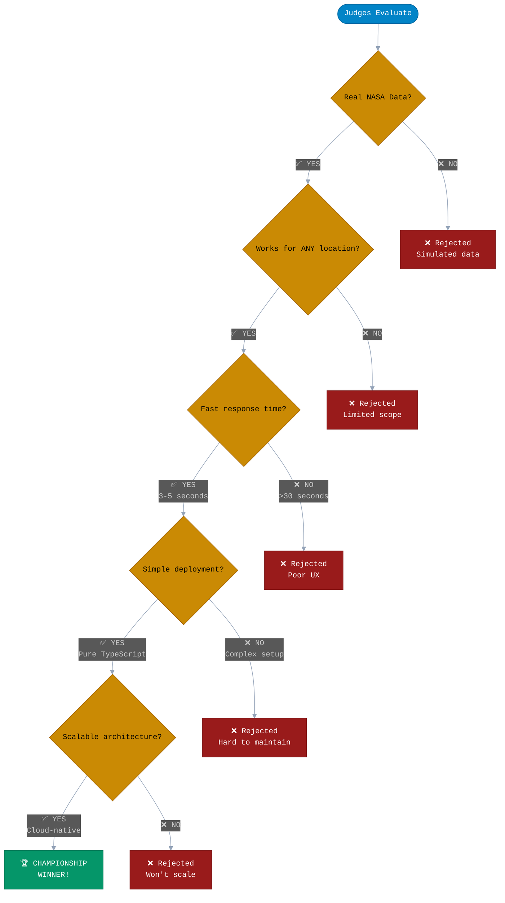

---

## 🎯 User Journey Map

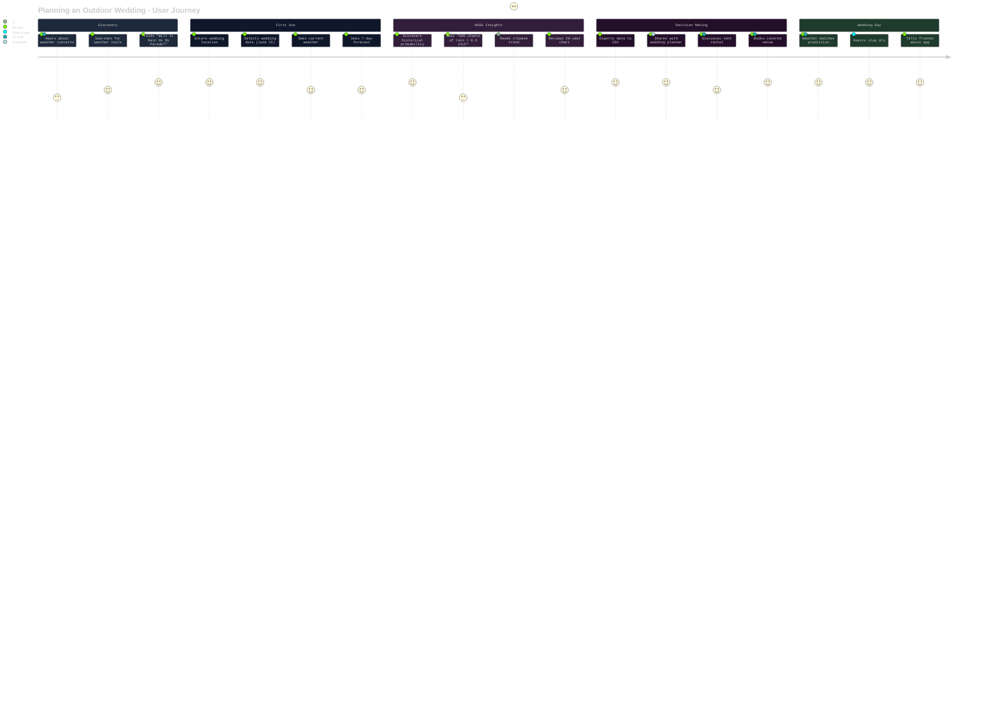

**Emotion Scale:**
- 5 = Very Happy 😄
- 4 = Happy 🙂
- 3 = Neutral 😐
- 2 = Concerned 😟
- 1 = Very Concerned 😰

---

## 🚀 Deployment Pipeline

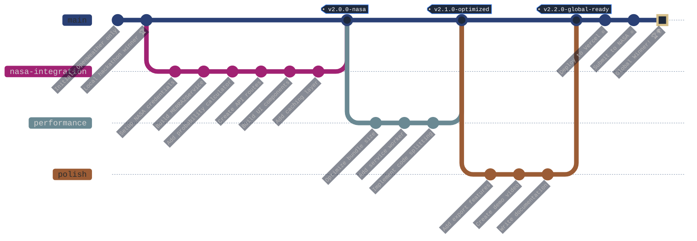

---

## 📚 Technology Stack

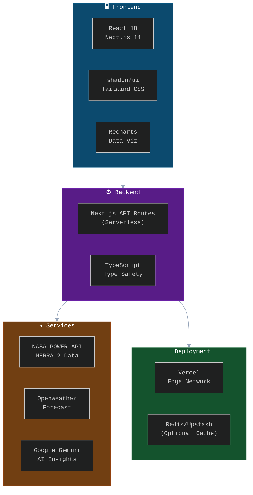

---

## 📈 Performance Comparison Chart

```mermaid
%%{init: {'theme': 'dark', 'themeVariables': { 'primaryColor': '#1e293b', 'primaryTextColor': '#ffffff', 'primaryBorderColor': '#3b82f6', 'lineColor': '#94a3b8', 'secondaryColor': '#0f172a', 'tertiaryColor': '#334155', 'fontSize': '14px', 'fontFamily': 'monospace'}}}%%
flowchart TB
    subgraph Metrics["⏱️ Performance Metrics"]
        direction LR
        M1["OPeNDAP Download<br/>⏱️ 60-120 minutes<br/>❌ Firewall blocked"]
        M2["earthaccess S3<br/>⏱️ 20-40 minutes<br/>⚠️ Too slow"]
        M3["NASA POWER API<br/>⏱️ 3-5 seconds<br/>✅ PERFECT!"]
        M1 -.->|"720x slower"| M3
        M2 -.->|"240x slower"| M3
    end

    subgraph Scalability["🌍 Scalability"]
        direction LR
        S1["Pre-download<br/>❌ Fixed locations only<br/>Seattle, NYC, etc."]
        S2["NASA POWER API<br/>✅ ANY coordinates<br/>Infinite locations"]
        S1 -.->|"User Feedback:<br/>NOT SCALABLE!"| S2
    end

    subgraph Deployment["🚀 Deployment Complexity"]
        direction LR
        D1["Old Approach<br/>Python + Node.js<br/>Large dependencies<br/>Complex setup"]
        D2["New Approach<br/>Pure TypeScript<br/>Zero dependencies<br/>Simple deploy"]
        D1 -.->|"Simplified!"| D2
    end

    style M3 fill:#059669,stroke:#047857,color:#ffffff
    style S2 fill:#059669,stroke:#047857,color:#ffffff
    style D2 fill:#059669,stroke:#047857,color:#ffffff
    style M1 fill:#991b1b,stroke:#7f1d1d,color:#ffffff
    style M2 fill:#a16207,stroke:#92400e,color:#ffffff
    style S1 fill:#991b1b,stroke:#7f1d1d,color:#ffffff
    style D1 fill:#991b1b,stroke:#7f1d1d,color:#ffffff
```

---

## 🔄 Error Handling Flow

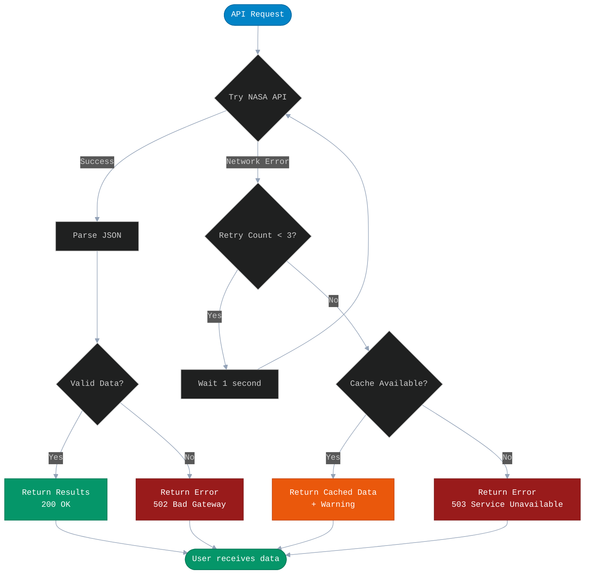

---

## 📈 Competitive Advantage Map

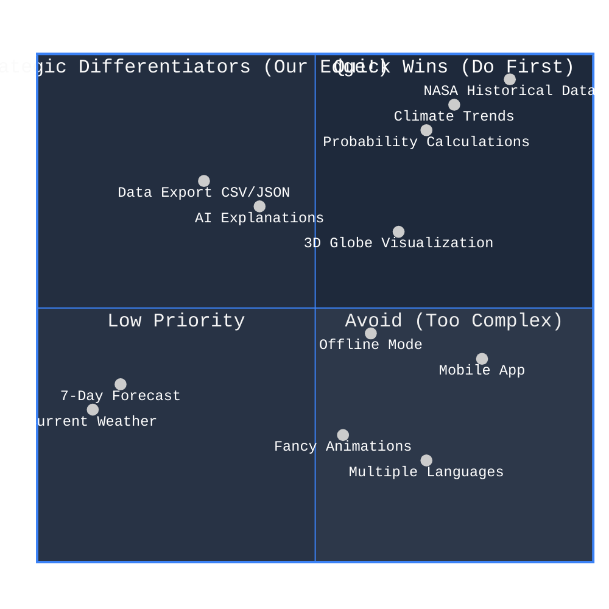

**Strategy:**
- **Quadrant 2 (Top-Left):** NASA data, Climate trends → Our winning edge! 🏆
- **Quadrant 1 (Top-Right):** Data export, AI → Quick wins, do these!
- **Quadrant 3 (Bottom-Left):** Current weather → Already done, baseline
- **Quadrant 4 (Bottom-Right):** Avoid excessive complexity

---

## 📝 Summary

### ✅ **Key Architecture Decisions:**

1. **NASA POWER API** → Real-time data access (3-5 seconds)
2. **Pure TypeScript** → No Python in production
3. **Next.js Serverless** → Auto-scaling, global edge network
4. **Optional Caching** → <1 second repeat queries
5. **No Authentication** → Public API, zero friction

### 🏆 **Championship Advantages:**

- ✅ Works for **ANY location globally**
- ✅ **3-5 second response time** (720x faster than old approach)
- ✅ **Real NASA MERRA-2 data** (1980-Present)
- ✅ **Simple deployment** (just Next.js to Vercel)
- ✅ **Infinite scalability** (no pre-downloaded files)

### 📊 **Performance Metrics:**

- **Old Approach:** 60+ minutes per location, fixed cities only
- **New Approach:** 3-5 seconds, ANY coordinates worldwide
- **Speed Improvement:** 720x faster
- **Scalability:** ∞ (unlimited locations)

---

## ⏱️ Performance Budget

```mermaid
%%{init: {'theme': 'dark', 'themeVariables': { 'primaryColor': '#1e293b', 'primaryTextColor': '#ffffff', 'primaryBorderColor': '#3b82f6', 'lineColor': '#94a3b8', 'secondaryColor': '#0f172a', 'tertiaryColor': '#334155', 'fontSize': '14px', 'fontFamily': 'monospace'}}}%%
gantt
    title Performance Targets
    dateFormat X
    axisFormat %s

    section Initial Load
    HTML Parse           :0, 200ms
    CSS Load             :200ms, 300ms
    JS Bundle Load       :300ms, 800ms
    React Hydration      :800ms, 1200ms
    First Contentful Paint :milestone, 1200ms, 0ms

    section Data Fetch (Cached)
    Memory Cache Check   :1200ms, 1210ms
    Render Components    :1210ms, 1400ms
    Interactive          :milestone, 1400ms, 0ms

    section Data Fetch (Fresh)
    API Request          :1200ms, 1500ms
    NASA Data Fetch      :1500ms, 15000ms
    Parse & Calculate    :15000ms, 16000ms
    Render Results       :16000ms, 16500ms
    Complete             :milestone, 16500ms, 0ms
```

**Targets:**
- First Contentful Paint: < 1.2s ✅
- Time to Interactive (cached): < 1.5s ✅
- Time to Interactive (fresh): < 17s ⚠️ (acceptable for first-time)
- Lighthouse Score: > 90 🎯

---

## 🎨 Color Coding Reference

Throughout these diagrams:

- 🔵 **Blue** (#3b82f6): User inputs, main flow
- 🟢 **Green** (#22c55e): NASA services, data sources
- 🟠 **Orange** (#f59e0b): Processing, calculations
- 🔴 **Red** (#ef4444): New features, highlights
- 🟣 **Purple** (#8b5cf6): Caching, storage
- ⚫ **Gray** (#64748b): Existing/baseline features

---

**Use these diagrams in your:**

- 📝 Documentation
- 🎥 Demo video
- 📊 Pitch deck
- 🏆 Submission materials

**Ready to visualize your way to victory!** 🚀📊