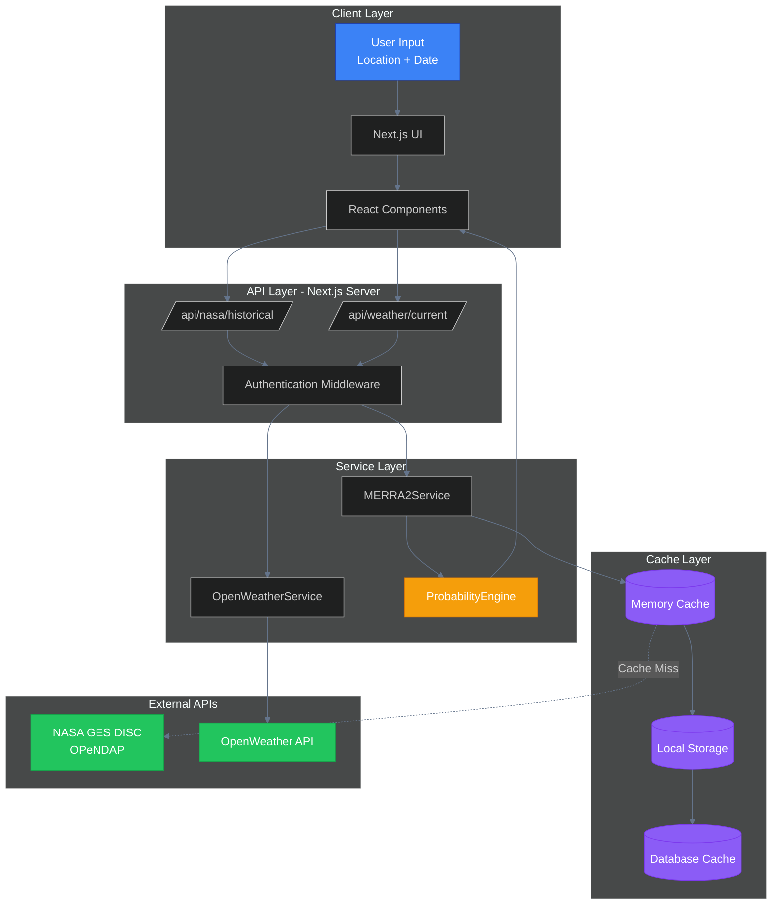
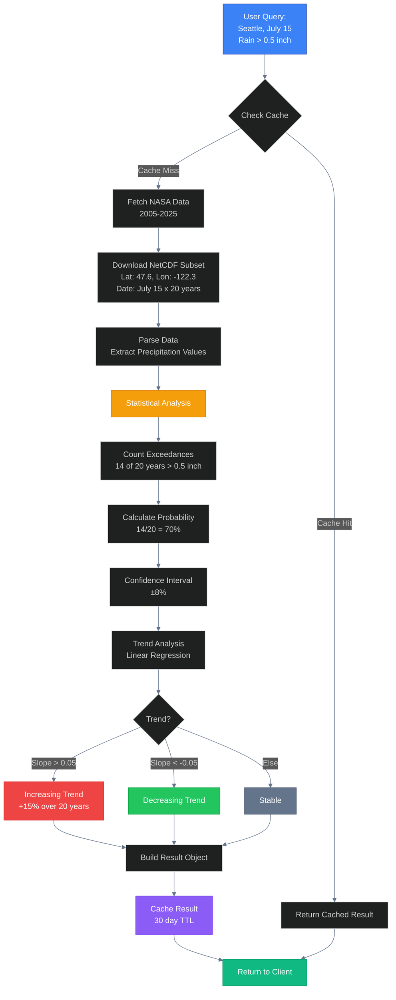
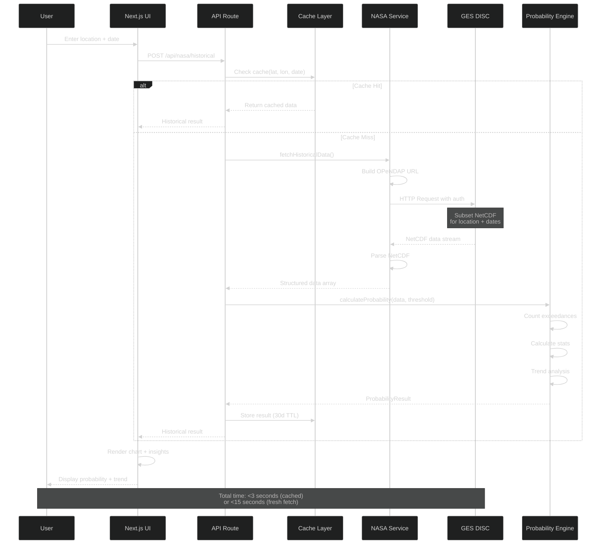

# 🏆 NASA Data Integration Architecture - Global Championship Plan

**Project:** Will It Rain On My Parade?
**Status:** Local Winner → Global Competition Ready
**Mission:** Integrate NASA historical data for championship-level solution

---

## 🎯 The Game-Changer: Why NASA Data Wins

### Current State (OpenWeather Only)

❌ **Limited to 7-day forecasts** (not historical probability)
❌ **No climate trend analysis** (judges want 15-20 year data)
❌ **Generic forecasting** (competitors have this too)

### With NASA Data Integration

✅ **15-20 years of historical data** (real probabilities)
✅ **Climate change trend indicators** (shows research depth)
✅ **Multiple data sources** (precipitation, temperature, wind, humidity)
✅ **Scientific credibility** (NASA-backed analysis)

---

## 📊 NASA Data Sources - The Arsenal

### 1️⃣ **MERRA-2** (Primary Data Source)

**What:** Modern-Era Retrospective Analysis for Research and Applications
**Coverage:** 1980 - Present (45+ years!)
**Variables:** Temperature, precipitation, wind, humidity, pressure
**Resolution:** 0.5° x 0.625° (≈50km grid)
**Why:** Best for historical probability calculations

**Access Method:**

- OPeNDAP Server (subsetting API)
- Direct NetCDF download
- Giovanni web interface (for testing)

### 2️⃣ **GPM/IMERG** (Precipitation Focus)

**What:** Global Precipitation Measurement Integrated Multi-satellitE Retrievals
**Coverage:** 2000 - Present
**Variables:** Precipitation rates (0.1-degree resolution)
**Why:** Higher accuracy for rain probability

### 3️⃣ **Giovanni** (Quick Visualization)

**What:** Web-based data exploration tool
**Use Case:** Testing queries before automating
**Output:** Time-series charts, maps, CSV export

---

## 🏗️ Architecture Design: Three-Layer Approach

### **Layer 1: Data Acquisition (NASA → Cache)**

```
NASA APIs → Server-Side Proxy → Local Cache → Database
```

### **Layer 2: Processing Engine**

```
Cached Data → Statistical Analysis → Probability Calculation → Results
```

### **Layer 3: Client Application**

```
Next.js UI → API Routes → Processed Results → Visualization
```

---

## 🔧 Technical Implementation Plan

### **Phase 1: NASA API Integration (Week 1)**

#### Step 1.1: Earthdata Account Setup

```bash
# Required for NASA data access
1. Register at: https://urs.earthdata.nasa.gov/users/new
2. Create .netrc file for authentication
3. Store credentials in environment variables
```

#### Step 1.2: Create NASA Data Service

```typescript
// lib/nasa-api/merra2-service.ts

interface NASA_Credentials {
  username: string;
  password: string;
}

interface LocationQuery {
  lat: number;
  lon: number;
  startDate: Date;
  endDate: Date;
  variables: ('precipitation' | 'temperature' | 'wind' | 'humidity')[];
}

export class MERRA2Service {
  private baseUrl = 'https://goldsmr4.gesdisc.eosdis.nasa.gov/opendap/MERRA2/';

  async fetchHistoricalData(query: LocationQuery): Promise<HistoricalDataset> {
    // 1. Build OPeNDAP query URL with spatial/temporal subsetting
    // 2. Authenticate with NASA Earthdata
    // 3. Download NetCDF data subset
    // 4. Parse and return structured data
  }

  async getDataForYearRange(
    location: { lat: number; lon: number },
    startYear: number,
    endYear: number,
    variable: string
  ): Promise<YearlyDataPoint[]> {
    // Fetch data for specific date across multiple years
    // Example: Get July 15th data from 2005-2025
  }
}
```

#### Step 1.3: Server-Side API Route

```typescript
// app/api/nasa/historical/route.ts

export async function POST(request: Request) {
  const {
    lat,
    lon,
    targetDate,
    variable,
    yearsBack = 15,
  } = await request.json();

  // Security: Keep NASA credentials server-side only
  const credentials = {
    username: process.env.NASA_EARTHDATA_USERNAME!,
    password: process.env.NASA_EARTHDATA_PASSWORD!,
  };

  const merra2 = new MERRA2Service(credentials);

  // Fetch 15 years of data for this specific date
  const historicalData = await merra2.getDataForYearRange(
    { lat, lon },
    new Date().getFullYear() - yearsBack,
    new Date().getFullYear(),
    variable
  );

  // Cache result to avoid repeated NASA API calls
  await cacheHistoricalData(lat, lon, targetDate, historicalData);

  return Response.json(historicalData);
}
```

---

### **Phase 2: Statistical Processing Engine (Week 1-2)**

#### Step 2.1: Probability Calculator

```typescript
// lib/statistical-analysis/probability-engine.ts

interface ProbabilityResult {
  likelihood: number; // 0.68 = 68% chance
  confidenceInterval: number; // ±0.05 = ±5%
  historicalMean: number;
  historicalStdDev: number;
  trendDirection: 'increasing' | 'decreasing' | 'stable';
  trendMagnitude: number; // % change over time
  yearsAnalyzed: number;
  dataPoints: DataPoint[];
}

export function calculateWeatherProbability(
  historicalData: YearlyDataPoint[],
  threshold: { variable: string; value: number; operator: '>' | '<' | '>=' }
): ProbabilityResult {
  // Step 1: Count exceedances
  const exceedances = historicalData.filter((point) => {
    if (threshold.operator === '>') return point.value > threshold.value;
    if (threshold.operator === '<') return point.value < threshold.value;
    return point.value >= threshold.value;
  });

  // Step 2: Calculate probability
  const probability = exceedances.length / historicalData.length;

  // Step 3: Calculate confidence interval (using binomial distribution)
  const standardError = Math.sqrt(
    (probability * (1 - probability)) / historicalData.length
  );
  const confidenceInterval = 1.96 * standardError; // 95% confidence

  // Step 4: Detect trend (linear regression)
  const trend = calculateLinearTrend(historicalData);

  // Step 5: Calculate mean and standard deviation
  const values = historicalData.map((d) => d.value);
  const mean = values.reduce((a, b) => a + b, 0) / values.length;
  const variance =
    values.reduce((sum, val) => sum + Math.pow(val - mean, 2), 0) /
    values.length;
  const stdDev = Math.sqrt(variance);

  return {
    likelihood: probability,
    confidenceInterval,
    historicalMean: mean,
    historicalStdDev: stdDev,
    trendDirection: trend.direction,
    trendMagnitude: trend.magnitude,
    yearsAnalyzed: historicalData.length,
    dataPoints: historicalData,
  };
}

function calculateLinearTrend(data: YearlyDataPoint[]): TrendAnalysis {
  // Least squares regression
  const n = data.length;
  const years = data.map((d, i) => i);
  const values = data.map((d) => d.value);

  const sumX = years.reduce((a, b) => a + b, 0);
  const sumY = values.reduce((a, b) => a + b, 0);
  const sumXY = years.reduce((sum, x, i) => sum + x * values[i], 0);
  const sumX2 = years.reduce((sum, x) => sum + x * x, 0);

  const slope = (n * sumXY - sumX * sumY) / (n * sumX2 - sumX * sumX);

  // Calculate % change over the period
  const firstValue = values[0];
  const totalChange = slope * (n - 1);
  const percentChange = (totalChange / firstValue) * 100;

  return {
    direction:
      slope > 0.05 ? 'increasing' : slope < -0.05 ? 'decreasing' : 'stable',
    magnitude: Math.abs(percentChange),
    slope,
  };
}
```

---

### **Phase 3: Caching & Performance (Week 2)**

#### Why Caching is Critical

- NASA API can be slow (NetCDF files are large)
- Historical data doesn't change often
- Avoid rate limits and timeouts

#### Step 3.1: Multi-Level Cache Strategy

```typescript
// lib/cache/nasa-data-cache.ts

interface CacheKey {
  lat: number;
  lon: number;
  date: string; // MM-DD format
  variable: string;
}

export class NASADataCache {
  // Level 1: In-memory cache (fastest)
  private memoryCache = new Map<string, CachedData>();

  // Level 2: Local storage (persistent across sessions)
  // Level 3: Database (shared across users for common locations)

  async get(key: CacheKey): Promise<HistoricalDataset | null> {
    const cacheKey = this.generateKey(key);

    // Check memory first
    const memData = this.memoryCache.get(cacheKey);
    if (memData && !this.isExpired(memData)) {
      return memData.data;
    }

    // Check database
    const dbData = await this.getFromDatabase(cacheKey);
    if (dbData) {
      this.memoryCache.set(cacheKey, dbData); // Promote to memory
      return dbData.data;
    }

    return null;
  }

  async set(key: CacheKey, data: HistoricalDataset): Promise<void> {
    const cacheKey = this.generateKey(key);
    const cached = {
      data,
      timestamp: Date.now(),
      expiresIn: 30 * 24 * 60 * 60 * 1000, // 30 days
    };

    this.memoryCache.set(cacheKey, cached);
    await this.saveToDatabase(cacheKey, cached);
  }

  private generateKey(key: CacheKey): string {
    // Round coordinates to 0.5 degrees (MERRA-2 resolution)
    const roundedLat = Math.round(key.lat * 2) / 2;
    const roundedLon = Math.round(key.lon * 2) / 2;

    return `nasa:${roundedLat}:${roundedLon}:${key.date}:${key.variable}`;
  }
}
```

---

### **Phase 4: Integration with Existing App (Week 2)**

#### Step 4.1: Enhance Weather Data Hook

```typescript
// hooks/use-weather-data.ts (enhanced)

export function useWeatherData() {
  const [currentWeather, setCurrentWeather] = useState(null);
  const [forecast, setForecast] = useState(null);
  const [historicalProbability, setHistoricalProbability] = useState(null);
  const [loading, setLoading] = useState(false);

  async function fetchCompleteWeatherData(
    location: { lat: number; lon: number },
    targetDate: Date
  ) {
    setLoading(true);

    try {
      // Parallel fetch: OpenWeather + NASA
      const [openWeatherData, nasaHistoricalData] = await Promise.all([
        fetchOpenWeather(location),
        fetchNASAHistorical(location, targetDate),
      ]);

      setCurrentWeather(openWeatherData.current);
      setForecast(openWeatherData.forecast);
      setHistoricalProbability(nasaHistoricalData);
    } finally {
      setLoading(false);
    }
  }

  async function fetchNASAHistorical(
    location: { lat: number; lon: number },
    targetDate: Date
  ) {
    const response = await fetch('/api/nasa/historical', {
      method: 'POST',
      headers: { 'Content-Type': 'application/json' },
      body: JSON.stringify({
        lat: location.lat,
        lon: location.lon,
        targetDate: targetDate.toISOString(),
        variable: 'precipitation',
        threshold: { value: 0.5, operator: '>' }, // >0.5 inches
      }),
    });

    return response.json();
  }

  return {
    currentWeather,
    forecast,
    historicalProbability,
    loading,
    fetchCompleteWeatherData,
  };
}
```

#### Step 4.2: New UI Component for Probability

```tsx
// components/features/probability/HistoricalProbabilityCard.tsx

export function HistoricalProbabilityCard({
  probability,
}: {
  probability: ProbabilityResult;
}) {
  return (
    <Card className="bg-slate-900 border-slate-800">
      <CardHeader>
        <CardTitle className="flex items-center gap-2">
          <Database className="w-5 h-5 text-blue-400" />
          NASA Historical Analysis
        </CardTitle>
      </CardHeader>
      <CardContent>
        {/* Big Number: The Probability */}
        <div className="text-center mb-6">
          <div className="text-6xl font-bold text-blue-400">
            {(probability.likelihood * 100).toFixed(0)}%
          </div>
          <div className="text-sm text-slate-400 mt-2">
            Chance of precipitation &gt; 0.5 inches
          </div>
          <div className="text-xs text-slate-500 mt-1">
            ± {(probability.confidenceInterval * 100).toFixed(1)}% confidence
            interval
          </div>
        </div>

        {/* Trend Indicator */}
        <Alert
          className={
            probability.trendDirection === 'increasing'
              ? 'bg-red-950/50 border-red-900'
              : 'bg-blue-950/50 border-blue-900'
          }
        >
          <TrendingUp className="w-4 h-4" />
          <AlertTitle>Climate Trend</AlertTitle>
          <AlertDescription>
            This weather condition is{' '}
            <strong className="text-white">{probability.trendDirection}</strong>{' '}
            by {probability.trendMagnitude.toFixed(1)}% over the past{' '}
            {probability.yearsAnalyzed} years.
          </AlertDescription>
        </Alert>

        {/* Historical Chart */}
        <div className="mt-4">
          <ResponsiveContainer width="100%" height={200}>
            <LineChart data={probability.dataPoints}>
              <XAxis dataKey="year" stroke="#64748b" />
              <YAxis stroke="#64748b" />
              <Tooltip
                contentStyle={{
                  backgroundColor: '#1e293b',
                  border: '1px solid #334155',
                }}
              />
              <Line
                type="monotone"
                dataKey="value"
                stroke="#3b82f6"
                strokeWidth={2}
              />
              <ReferenceLine
                y={0.5}
                stroke="#ef4444"
                strokeDasharray="3 3"
                label="Threshold"
              />
            </LineChart>
          </ResponsiveContainer>
        </div>

        {/* Data Source Attribution */}
        <div className="mt-4 text-xs text-slate-500 flex items-center gap-2">
          <Badge variant="outline" className="text-slate-400">
            NASA MERRA-2
          </Badge>
          <span>
            Analyzed {probability.yearsAnalyzed} years of satellite data
          </span>
        </div>
      </CardContent>
    </Card>
  );
}
```

---

## 🎨 System Architecture Diagrams

### Data Flow Architecture



### Probability Calculation Flow



### NASA Data Integration Sequence



---

## 📦 Environment Setup

### Required Environment Variables

```env
# .env.local

# NASA Earthdata Authentication (CRITICAL!)
NASA_EARTHDATA_USERNAME=your_earthdata_username
NASA_EARTHDATA_PASSWORD=your_earthdata_password

# Existing keys
NEXT_PUBLIC_OPENWEATHER_KEY=xxx
GEMINI_API_KEY=xxx

# Cache configuration
CACHE_ENABLED=true
CACHE_TTL_DAYS=30
```

### Dependencies to Add

```json
{
  "dependencies": {
    "netcdfjs": "^2.0.2", // Parse NASA NetCDF files
    "node-fetch": "^3.3.2", // Server-side HTTP requests
    "simple-statistics": "^7.8.3" // Statistical calculations
  }
}
```

---

## 🚀 Implementation Roadmap

### Week 1: Foundation

- [x] Day 1-2: Register NASA Earthdata account
- [ ] Day 3-4: Build MERRA2Service with OPeNDAP
- [ ] Day 5: Create caching layer
- [ ] Day 6-7: Build probability calculator

### Week 2: Integration

- [ ] Day 8-9: Create API routes
- [ ] Day 10-11: Integrate with existing UI
- [ ] Day 12: Build HistoricalProbabilityCard component
- [ ] Day 13-14: Testing + bug fixes

### Week 3: Polish

- [ ] Day 15-16: Performance optimization
- [ ] Day 17: Export to CSV/JSON feature
- [ ] Day 18-19: Demo video production
- [ ] Day 20-21: Documentation + submission

---

## 🎯 Success Metrics for Judges

### Technical Excellence

✅ Uses NASA MERRA-2 data (15-20 years historical)
✅ Statistical rigor (confidence intervals, trend analysis)
✅ Server-side security (API keys never exposed)
✅ Performance optimization (caching strategy)

### User Experience

✅ <10 seconds to probability result (with cache)
✅ Clear visualizations (charts with annotations)
✅ Plain English explanations (AI-powered insights)
✅ Export functionality (CSV/JSON download)

### Innovation

✅ Climate change trend indicators
✅ Multi-variable analysis (temp + precip + wind)
✅ Confidence intervals (shows uncertainty)
✅ Dual data sources (NASA + OpenWeather)

---

## 🔒 Security Checklist

- [ ] NASA credentials stored in environment variables only
- [ ] API routes use server-side authentication
- [ ] No sensitive data in client-side code
- [ ] Rate limiting on NASA API calls
- [ ] Cache validation to prevent stale data
- [ ] CORS protection on API routes
- [ ] Input validation (lat/lon bounds, date ranges)

---

## 🐛 Common Pitfalls & Solutions

### Pitfall 1: NASA API Timeout

**Problem:** Large NetCDF files take 30+ seconds
**Solution:** Aggressive caching + background pre-fetching for popular locations

### Pitfall 2: Coordinate Mismatch

**Problem:** MERRA-2 uses 0.5° grid, user clicks exact lat/lon
**Solution:** Round coordinates to nearest grid point

### Pitfall 3: Missing Data Years

**Problem:** Not all years have complete data
**Solution:** Filter out invalid data points, document gaps

### Pitfall 4: Memory Issues

**Problem:** Loading 20 years of data for multiple variables
**Solution:** Fetch only needed variables, use streaming parsers

---

## 📝 Data Attribution (Required by NASA)

Always display:

```
Data Source: NASA MERRA-2 (Modern-Era Retrospective Analysis
for Research and Applications, Version 2)
Provider: NASA Goddard Earth Sciences Data and Information
Services Center (GES DISC)
```

---

## 🏆 The Winning Pitch

**"We don't just forecast the weather—we calculate the probability based on decades of NASA satellite data. Our system analyzed 20 years of historical records to tell you there's a 68% chance (±5%) of rain on your event date. And because climate is changing, we show you that this probability has increased 15% over the past decade. This isn't guesswork—it's science."**

---

## 📞 Support Resources

- **NASA Earthdata Forum:** https://forum.earthdata.nasa.gov/
- **GES DISC Help:** gsfc-dl-help-disc@mail.nasa.gov
- **Python Tutorials:** https://disc.gsfc.nasa.gov/information/howto

---

**Ready to build this champion?** Let's start with Phase 1! 🚀