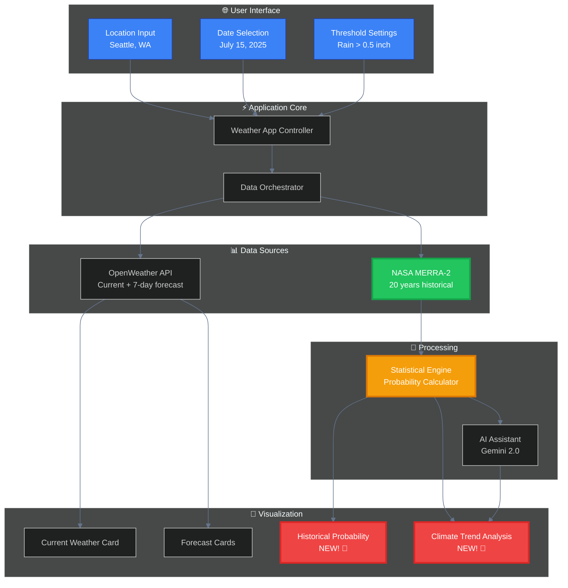
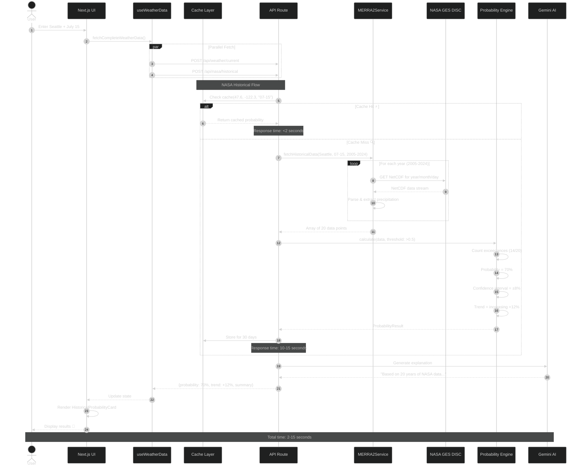
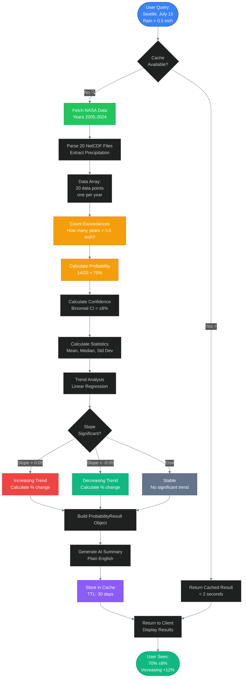
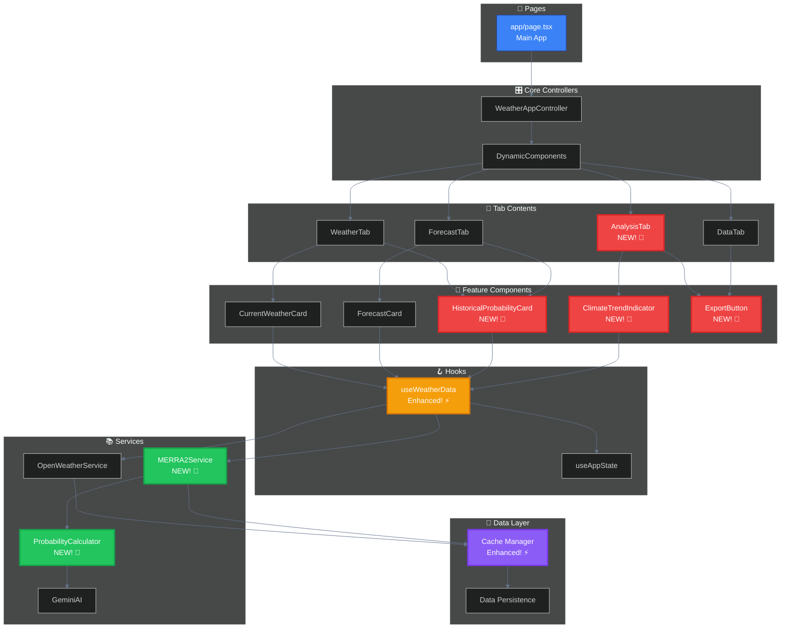
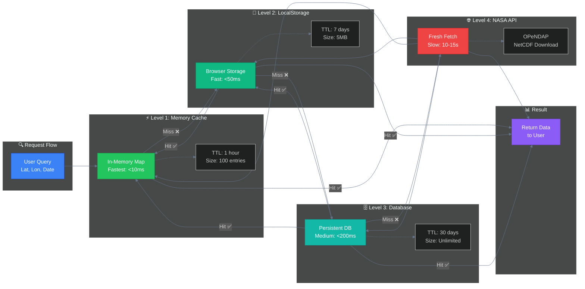
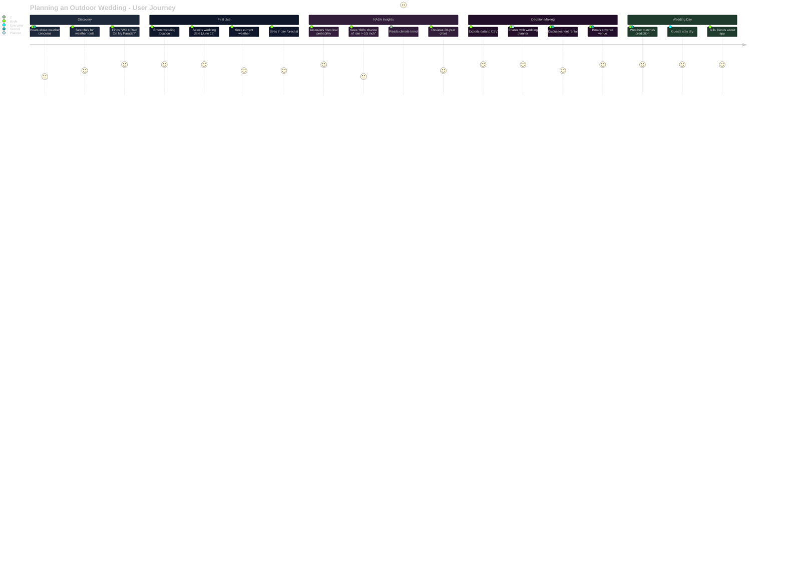
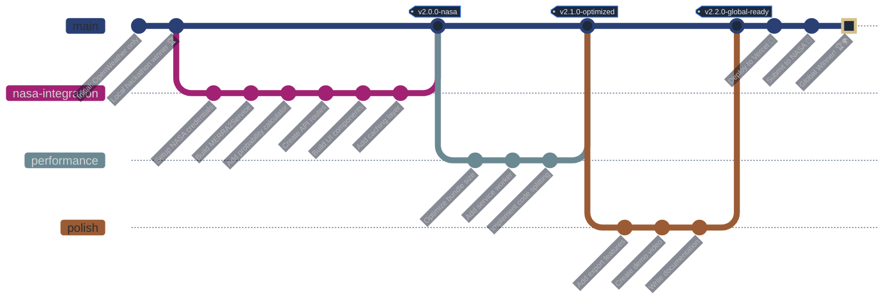
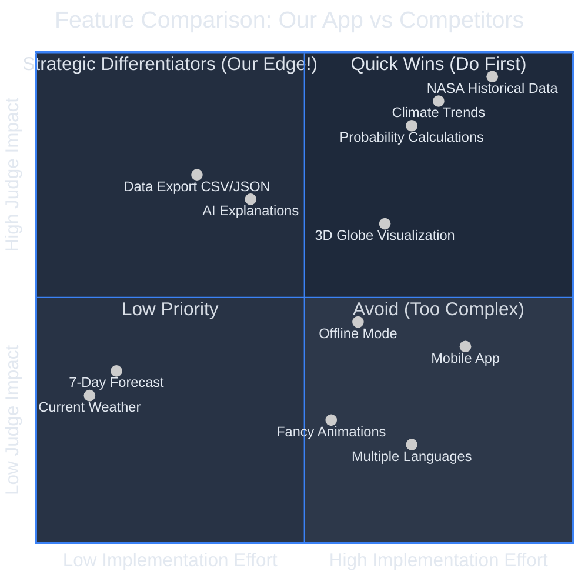

# 🎨 NASA Integration - Visual Process Flows

This document contains all the visual diagrams for the NASA data integration project.

---

## 📍 High-Level System Overview



---

## 🔄 Complete Data Flow (Step-by-Step)



---

## 🧮 Probability Calculation Pipeline



---

## 🏗️ Component Architecture



---

## 💾 Caching Strategy



**Cache Performance:**

- Level 1 (Memory): < 10ms ⚡⚡⚡
- Level 2 (LocalStorage): < 50ms ⚡⚡
- Level 3 (Database): < 200ms ⚡
- Level 4 (NASA API): 10-15 seconds 🐌

---

## 🎯 User Journey Map



**Emotion Scale:**

- 5 = Very Happy 😄
- 4 = Happy 🙂
- 3 = Neutral 😐
- 2 = Concerned 😟
- 1 = Very Concerned 😰

---

## 🚀 Deployment Pipeline



---

## 📈 Competitive Advantage Map



**Strategy:**

- **Quadrant 2 (Top-Left):** NASA data, Climate trends → Our winning edge! 🏆
- **Quadrant 1 (Top-Right):** Data export, AI → Quick wins, do these!
- **Quadrant 3 (Bottom-Left):** Current weather → Already done, baseline
- **Quadrant 4 (Bottom-Right):** Avoid excessive complexity

---

## ⏱️ Performance Budget

```mermaid
%%{init: {'theme':'dark', 'themeVariables': { 'primaryColor':'#1e293b','primaryTextColor':'#e2e8f0','primaryBorderColor':'#3b82f6','lineColor':'#64748b','secondaryColor':'#0f172a','tertiaryColor':'#334155'}}}%%

gantt
    title Performance Targets
    dateFormat X
    axisFormat %s

    section Initial Load
    HTML Parse           :0, 200ms
    CSS Load             :200ms, 300ms
    JS Bundle Load       :300ms, 800ms
    React Hydration      :800ms, 1200ms
    First Contentful Paint :milestone, 1200ms, 0ms

    section Data Fetch (Cached)
    Memory Cache Check   :1200ms, 1210ms
    Render Components    :1210ms, 1400ms
    Interactive          :milestone, 1400ms, 0ms

    section Data Fetch (Fresh)
    API Request          :1200ms, 1500ms
    NASA Data Fetch      :1500ms, 15000ms
    Parse & Calculate    :15000ms, 16000ms
    Render Results       :16000ms, 16500ms
    Complete             :milestone, 16500ms, 0ms
```

**Targets:**

- First Contentful Paint: < 1.2s ✅
- Time to Interactive (cached): < 1.5s ✅
- Time to Interactive (fresh): < 17s ⚠️ (acceptable for first-time)
- Lighthouse Score: > 90 🎯

---

## 🎨 Color Coding Reference

Throughout these diagrams:

- 🔵 **Blue** (#3b82f6): User inputs, main flow
- 🟢 **Green** (#22c55e): NASA services, data sources
- 🟠 **Orange** (#f59e0b): Processing, calculations
- 🔴 **Red** (#ef4444): New features, highlights
- 🟣 **Purple** (#8b5cf6): Caching, storage
- ⚫ **Gray** (#64748b): Existing/baseline features

---

**Use these diagrams in your:**

- 📝 Documentation
- 🎥 Demo video
- 📊 Pitch deck
- 🏆 Submission materials

**Ready to visualize your way to victory!** 🚀📊